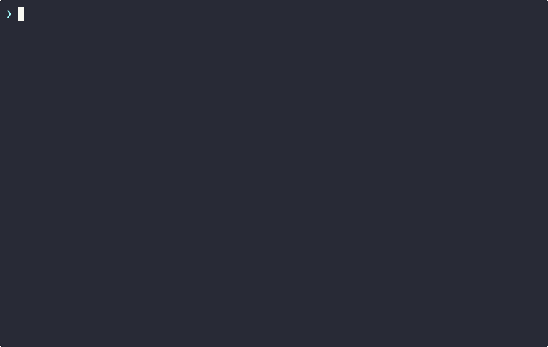

<p align="center">
  <h1 align="center">README Roast</h1>
  <p align="center">
    <strong>Roast your README against 90 top-starred repos. Find what's killing your stars.</strong>
  </p>
</p>

<p align="center">
  <a href="https://github.com/hidai25/readme-roast/stargazers"></a>
  <a href="https://opensource.org/licenses/MIT"></a>
  <a href="https://github.com/hidai25/readme-roast/issues"></a>
  <a href="CONTRIBUTING.md"></a>
</p>

---

Your README is your landing page. If visitors can't understand what your project does in 5 seconds, they leave. README Roast scores your README against patterns from top-starred repos in your category and tells you exactly what to fix — backed by benchmark data from 90 repos across 6 categories.

We roasted our own README first. It scored **47/100**. We fixed it. You're reading the result.

<p align="center">
  
</p>

## Table of Contents

- [Prerequisites](#prerequisites)
- [Quick Start](#quick-start)
- [Example: Roasting EvalView](#example-roasting-evalview-77-stars)
- [What It Scores](#what-it-scores)
- [Benchmark Categories](#benchmark-categories)
- [All Commands](#all-commands)
- [Track Your Progress](#track-your-progress)
- [How It Works](#how-it-works)
- [Contributing](#contributing)

## Prerequisites

**Requires [Claude Code](https://claude.ai/code)** — README Roast runs as Claude Code skills. Install Claude Code first, then:

```bash
git clone https://github.com/hidai25/readme-roast
cd readme-roast
claude
```

## Quick Start

Inside Claude Code, run:

```bash
# Roast any GitHub repo's README
/readme-audit https://github.com/your/repo

# Roast the current repo
/readme-audit
```

## Example: Roasting EvalView (77 stars)

We ran `/readme-audit` on [EvalView](https://github.com/hidai25/eval-view) and got this:

```
README Score: 77/100 — Good

┌──────────────────────────┬───────┬──────────────────┐
│         Category         │ Score │ vs. Category Avg │
├──────────────────────────┼───────┼──────────────────┤
│ Hero & Value Prop        │ 82    │ -1               │
│ Visual Proof             │ 78    │ +10              │
│ Install & Quickstart     │ 88    │ +4               │
│ Trust Signals            │ 64    │ -20              │
│ Structure & Scannability │ 68    │ -12              │
│ Differentiation & CTA    │ 76    │  0               │
└──────────────────────────┴───────┴──────────────────┘

Top Star Killers:
1. Trust Signals (-20 vs avg) — No "used by" logos, 60% of testing repos have them
2. Structure (-12 vs avg) — 450+ lines, no TOC, kitchen-sink syndrome
3. Hero (-1 vs avg) — 3 bold paragraphs push the GIF demo to the fold boundary
```

Not "your README could be better." Instead: "You're 20 points below average on trust signals because 60% of testing repos have 'used by' logos and you don't."

## What It Scores

```
README Score = (Hero × 25%) + (Visuals × 20%) + (Install × 15%)
             + (Trust × 15%) + (Structure × 15%) + (Differentiation × 10%)
```

| Category | What It Checks |
|----------|---------------|
| **Hero & Value Prop** (25%) | Can someone understand what this does and why in 5 seconds? |
| **Visual Proof** (20%) | GIF, screenshot, or demo showing it actually works? |
| **Install & Quickstart** (15%) | Steps from zero to "wow, this works"? |
| **Trust Signals** (15%) | Badges, "used by" logos, maintenance signals? |
| **Structure** (15%) | Scannable in 30 seconds? TOC, headings, bullets? |
| **Differentiation** (10%) | Why this over alternatives? Clear CTA? |

Each dimension is scored against **real benchmark data** from 15-20 top repos in your category — not generic advice.

## Benchmark Categories

| Category | Repos | Examples |
|----------|-------|---------|
| CLI Tools | 15 | ripgrep, fzf, bat, starship, lazygit |
| AI/ML | 15 | ollama, langchain, open-interpreter, dspy |
| Web Frameworks | 15 | next.js, astro, fastapi, supabase, hono |
| Testing | 15 | playwright, vitest, cypress, jest, k6 |
| DevOps | 15 | terraform, caddy, traefik, dagger, act |
| Library | 15 | axios, zod, pydantic, rich, tanstack-query |

Your repo is auto-detected into a category based on GitHub topics, language, and description.

## All Commands

| Command | What It Does |
|---------|-------------|
| `/readme-audit <url>` | Full roast with scores, benchmarks, and action plan |
| `/readme-audit` | Roast the current repo |
| `/readme-hero <url>` | Deep dive: hero section & value prop |
| `/readme-install <url>` | Deep dive: install friction |
| `/readme-trust <url>` | Deep dive: trust signals |
| `/readme-visuals <url>` | Deep dive: visual proof |
| `/readme-structure <url>` | Deep dive: scannability |
| `/readme-benchmark <url>` | Compare against category leaders |
| `/readme-report` | Generate shareable markdown report |
| `/readme-report-pdf` | Generate PDF report with charts |
| `/readme-compare` | Before/after delta |
| `/readme-rewrite` | Generate improved README sections |
| `/readme-star-killers` | Quick diagnostic: what's killing your stars |
| `/readme-history` | Audit timeline + score progression |
| `/readme-history stars` | Score-to-star velocity correlation |

## Track Your Progress

Every audit auto-saves to `.readme-roast/` inside your repo. Git-friendly. Designed to be committed.

```
/readme-history

Score Progression:
  #1  2026-03-30  ████████░░░░░░░░░░░░  47/100  Needs Work   ⭐ 1
  #2  2026-04-05  ████████████░░░░░░░░  65/100  Fair         ⭐ 12   ▲+18
  #3  2026-04-12  ███████████████░░░░░  78/100  Good         ⭐ 45   ▲+13

Overall: +31 points in 13 days | Stars: 1 → 45
```

Then use `/readme-compare` to see exactly which changes moved the needle.

## How It Works

```
/readme-audit https://github.com/user/repo
        │
        ├── Fetch README + repo metadata
        ├── Detect category (CLI, AI/ML, Web, Testing, DevOps, Library)
        │
        ├── [Parallel] First Impression Agent
        │   ├── Hero & Value Prop scoring
        │   ├── Visual Proof detection
        │   └── Structure & Scannability
        │
        ├── [Parallel] Conversion Agent
        │   ├── Trust Signals
        │   ├── Install Friction
        │   └── Differentiation & CTA
        │
        ├── [Parallel] Competitive Agent
        │   └── Benchmark comparison
        │
        ├── Score aggregation + star killer ranking
        ├── README-AUDIT-REPORT.md
        └── Auto-save → .readme-roast/snapshots/
```

14 Claude Code skills, 3 parallel subagents, 6 benchmark categories.

## Contributing

See [CONTRIBUTING.md](CONTRIBUTING.md). PRs welcome, especially for:
- Adding repos to benchmark categories
- New benchmark categories (mobile, gamedev, data engineering, etc.)
- Scoring rubric refinements

## License

[MIT](LICENSE)

---

Built by [Hidai Bar-Mor](https://github.com/hidai25) — also building [EvalView](https://github.com/hidai25/eval-view), regression testing for AI agents.
